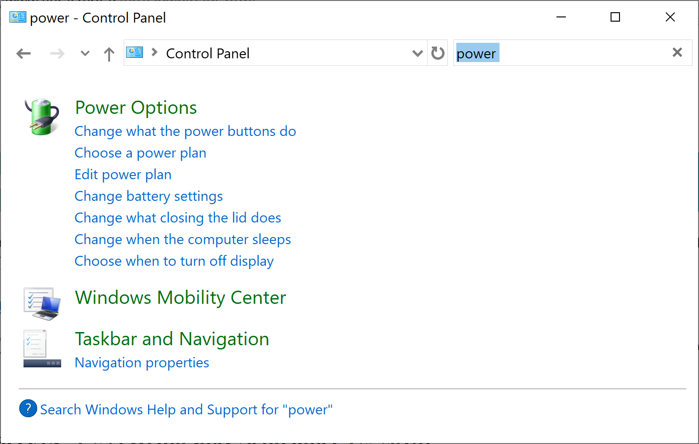
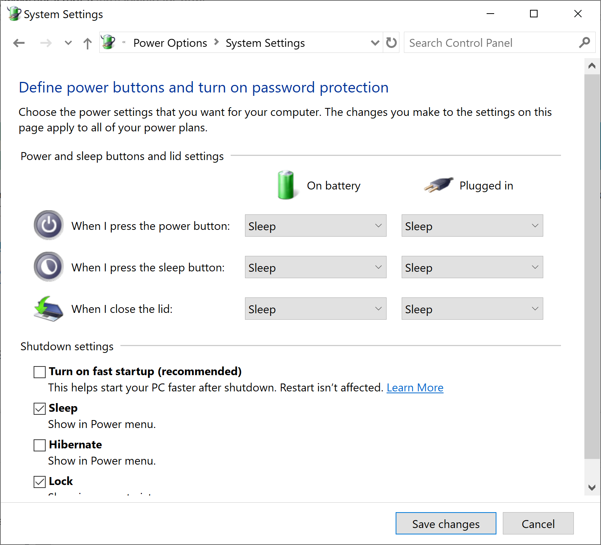
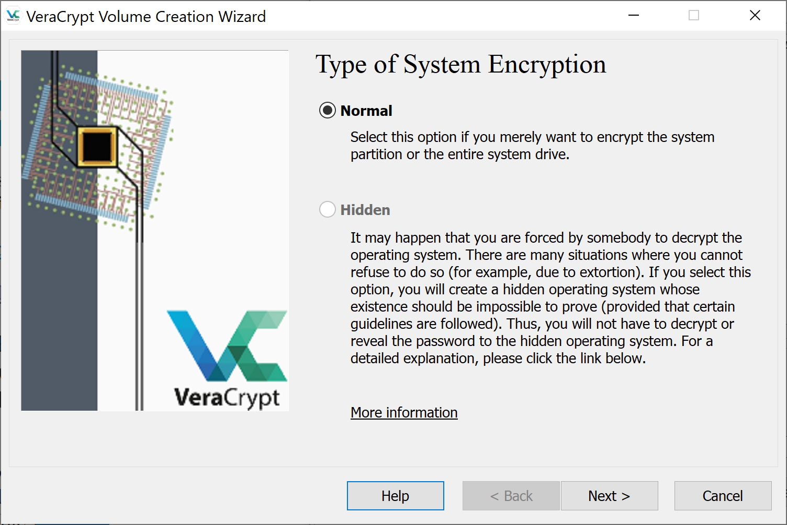
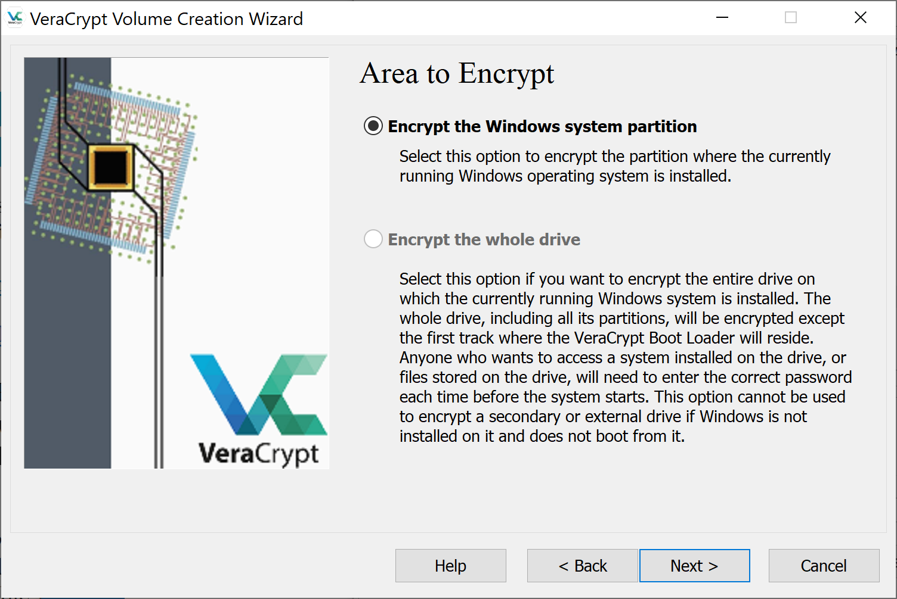
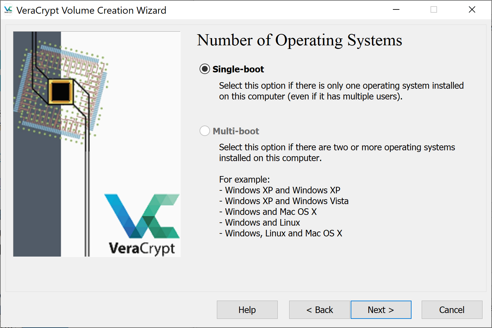
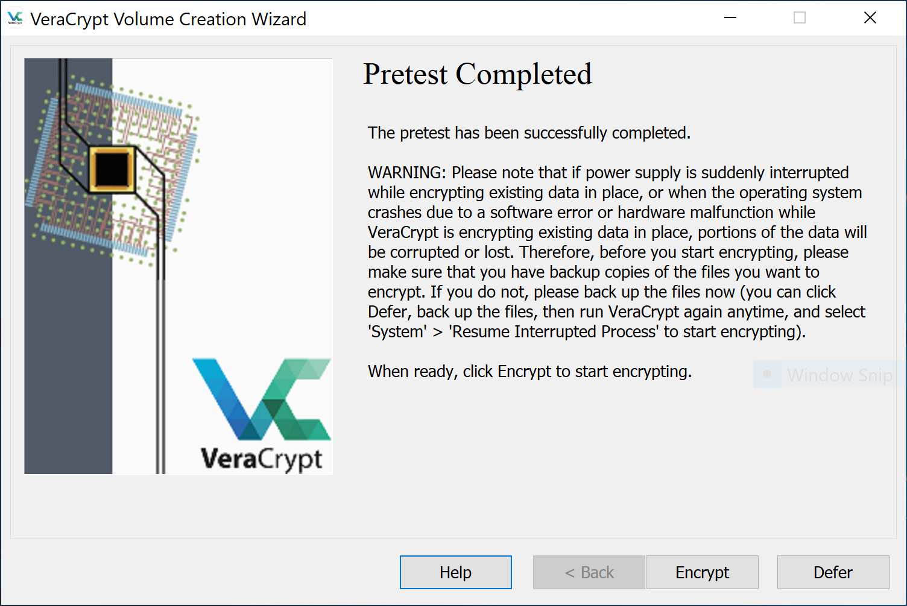
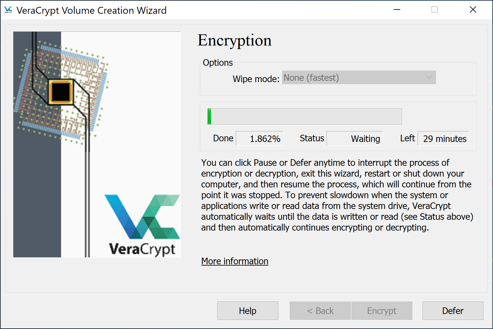

# Arch Linux and Windows Installation: UEFI and Encrypted (2019)

Arch Linux is my primary workstation OS. I run it as a dual boot alongside Windows. While I rarely
boot the Windows partition, there are edge cases where it has come in use. Booting occurs with 
UEFI.  Root volumes for both operating systems are encrypted. This guide describes that 
installation.


## Installation Media

This section covers creating installation media for Windows and Arch Linux. You'll need 3 USB 
drives sized to at least 8GB. These steps cover media creation from a Windows (for the Windows 10 
ISO) and Linux (for the Arch Linux ISO)  workstations. There are many alternative ways to create
installation media. If you choose to go with an alternative, skip this section.

### Windows Installation Media

As of Windows 10, Microsoft requires you to download a tool to create windows installation media. 
This `.exe` requires a Windows host to create the installation media. If you do not have a Windows
host to run this installer, Microsoft offers a USB for purchase.

Windows did not historically have this restriction. For example, 
[Windows 8](https://www.microsoft.com/en-us/software-download/windows8ISO). You could follow this
guide using Window 8. To create installation media directly from an ISO, consider
[WoeUSB](https://github.com/slacka/WoeUSB).

### Arch Linux Installation Media

1. Download the Arch Linux ISO.

    https://www.archlinux.org/download

2. Insert a USB drive.

3. List block devices and determine the device name.

    ```
    lsblk

    NAME                    MAJ:MIN RM   SIZE RO TYPE  MOUNTPOINT
    sda                       8:0    1  29.2G  0 disk
    |-sda1                    8:1    1   602M  0 part
    `-sda2                    8:2    1    64M  0 part
    nvme0n1                 259:0    0   477G  0 disk
    |-nvme0n1p1             259:1    0   512M  0 part  /boot
    `-nvme0n1p2             259:2    0 476.4G  0 part
      `-cryptroot\x5cx2callow-discards\x5cx2cheader
                            254:0    0 476.4G  0 crypt
        `-vg0-root          254:1    0 476.4G  0 lvm   /
    ```

    > In the above example, the USB drive is `sda`.

4. Write the ISO to the device using dd.

    ```
    dd bs=4M if=path/to/archlinux.iso of=/dev/sdx status=progress oflag=sync
    ```

    * `dd`: copies and converts a file based on arguments.
    * `bs`: amount of bytes to write at a time.
    * `if`: specify a file to read rather than stdin.
    * `of`: specify a file to write to rather than stdout.
    * `status`: level to log to stderr; progress shows periodic transfer stats.
    * `oflag`: set to sync synchronizes I/O for data and metadata.


## BIOS Settings

1. Boot into BIOS.

    > Often accomplished by hitting F2 on start-up.

2. Verify UEFI booting is enabled.

3. Verify Secure Boot is disabled.

    > Arch Linux can be installed with Secure Boot. See 
      https://wiki.archlinux.org/index.php/Secure_Boot


## Installing Windows

This section covers installing Windows. Installing it first allows reuse of the Windows-created
EFI partition. Using VeraCrypt, the Windows partition will be encrypted.

1. Insert the USB containing Windows.

1. Power on.

1. While booting, open the device boot menu.

    > Often achieved by hitting F12 during boot.

1. Select the USB device in UEFI mode.

    > If you boot in legacy mode, the Arch UEFI installation will **not** work.

1. Select the language to install and click Next.

1. Click Install now

1. Enter your product key and click Next.

1. Accept the license terms and click Next.

1. Click Custom: Install Windows only (advanced).

1. Delete all existing partitions.

1. Create a new partition of the size you'd like Windows to occupy.

    > Windows creates additoinal partitions including the 100.0MB System partition that will act
      as the EFI partition.

1. Click Next and wait for Windows to install.

    > After the installation completes, the machine will reboot.

1. After reboot, go through the Windows setup procedure.

1. Open Control Panel.

1. In the top right search, enter `power`.

    

1. Click `Change what the power buttons do`.

1. Click `Change settings that are unavailble`.

1. Uncheck `Turn on fast startup (recommended)`.

    
    

    > To understand why fast startup is not recommended, see 
      [https://wiki.archlinux.org/index.php/Dual_boot_with_Windows#Fast_Start-Up](https://wiki.archlinux.org/index.php/Dual_boot_with_Windows#Fast_Start-Up)

1. Open Start > Settings > Update & Security and Check for updates.

1. Allow all Windows updates to download and install before proceeding.

1. Download and install VeraCrypt.

    https://www.veracrypt.fr/en/Downloads.html

1. Launch VeraCrypt.

1. From the menu bar, open System > Encrypt System Partition/Drive

    

1. Choose Normal.

    

1. Choose Encrypt the Windows system partition.

    

1. Choose Single-boot

    

    > While you will have a multi-boot system eventually. This installation will have grub point
      to veracrypt that will then decrypt and point to windows. Thus, vercrypt needs to know 
      nothing about Linux.  

1. Choose your preferred encryption algorithm and click Next.

1. Create a strong password.

1. Allow VeraCrypt to collect random data.

1. If desired, create a rescue disk.

    > This will require a USB drive to save to.

1. Choose your preferred Wipe Mode.

1. Run the System Encryption Pretest.

    > This will require your machine to be restarted.

1. Upon restart, enter your encryption password when prompted.

1. Log back in to your Windows system.

1. VeraCrypt will pop back up to tell you the Pretest Completed.

    

1. Click Encrypt and run the encryption.

    > This will encrypt the file system and take several minutes.

1. Allow the encryption to complete.

    

1. Power off the machine.

## Installing Arch Linux

This section covers installing Arch Linux. Using Linux Unified Key Setup (LUKS), the root partition 
will be encrypted.

1. Insert the USB containing Arch Linux.

1. Boot the machine.

1. While booting, open the device boot menu.

    Often a key like F12 launches the boot menu.

1. Select the USB device.

    If legacy boot is enabled on your system, assure you're choosing to boot the USB via UEFI.

1. At the Arch Boot Menu, hit `e` at the menu to edit parameters.

1. Add `nomodeset video=1280x760` to the end.

    This boots the installer in lower resolution making the console easier to see.

1. If `TODO: Prompt here` is seen on bootup, unplug and replug the USB.

    The media is re-detected and Arch Linux loads.

1. Run `wifi-connect` and select a wireless network.

    If plugged into ethernet, this step can be skipped.

1. Validate connectivity.

    ```
    ping google.com   

    PING google.com (216.58.193.206) 56(84) bytes of data.
    64 bytes from lax02s23-in-f14.1e100.net time=809 ms
    64 bytes from lax02s23-in-f14.1e100.net time=753 ms
    ```

### Disk Partitioning

1. List block devices to determine the name of the drive.

    ```
    lsblk

    NAME                                            MAJ:MIN RM   SIZE RO TYPE  MOUNTPOINT
    nvme0n1                                         259:0    0   477G  0 disk  
    |-nvme0n1p1                                     259:1    0   512M  0 part  /boot
    `-nvme0n1p2                                     259:2    0 476.4G  0 part  
      `-cryptroot\x5cx2callow-discards\x5cx2cheader 254:0    0 476.4G  0 crypt 
        `-vg0-root                                  254:1    0 476.4G  0 lvm   /
    ```

    In the above, the drive is mapped to `/dev/nvme0n1`.

2. Launch cgdisk for the drive above.

    ```
    cgdisk /dev/nvme0n1
    ```

    `cgdisk` is a curses-based GUID partition table manipulator. Unlike the command-only `fdisk`
    approach, `cgdisk` provides a text-menu for writing partitions.

3. Select the free space.

4. Choose `[  New  ]`.

5. Enter no value for First sector (chooses default).

    > This means the Linux partition starts directly at the end of the Windows partition. Some
      believe it is best to leave a small amount of free space between partitions. However, I have
      not had issues with this.

6. Enter no value for Size in sectors (chooses default).

    > This is the end size of the partition.

7. Enter no value for Hex code or GUID (chooses default).

    > Default is 8300, Linux filesystem. A list can be found at 
      https://gist.github.com/gotbletu/a05afe8a76d0d0e8ec6659e9194110d2

9. Name the partition `root`.

10. Note the partition number of the EFI System partition. This will be reference later when
configuring grub.

11. Choose `[   Write   ]` and say yes.

12. Choose `[   Quit    ]`.

### Encrypting and Configuring the Root Partition

1. Encrypt the root partition.

    ```
    cryptsetup -y --use-random luksFormat /dev/nvme0n1p5
    ```

    > At the confirmation prompt, be sure to type `YES` in uppercase.

    * `-y`: interactively requests the passphrase twice.
    * `--use-random`: uses /dev/random to produce keys.
    * `luksFormat`: initializes a LUKS partition.


2. Open the LUKS device

    ```
    cryptsetup luksOpen /dev/nvme0n1p5 encrypted-root
    ```

    * `luksOpen`: Opens the LUKS device and creates a mapping in `/dev/mapper`.

3. Initialize the physical volume (PV).

    ```
    pvcreate /dev/mapper/encrypted-root
    ```

4. Initialize a volume group (VG) on the new PV.

    ```
    vgcreate vg /dev/mapper/encrypted-root
    ```

5. Create a logical volume (LV) on that VG named root.

    ```
    lvcreate -l +100%FREE vg --name root
    ```

    * `-l +100%FREE` ensures the LV takes up all the space in the VG.


6. Run lsblk to view the new volume relationship.

7. Format the LV as a `ext4` file system.

    ```
    mkfs.ext4 /dev/mapper/vg-root
    ```

### Mounting and Installing

1. Mount the LV at `/mnt`.

    ```
    mount /dev/mapper/vg-root /mnt
    ```

2. Create a `boot` directory at root.

    ```
    mkdir -p /mnt/boot/efi
    ```

3. Mount the Window's created EFI partition to `/mnt/boot`.

    ```
    mount /dev/nvme0n1p2 /mnt/boot/efi
    ```

    > This is the partition you noted in the Disk Partitioning section.

4. Install packages on the root file system.

    ```
    pacstrap /mnt base base-devel grub efibootmgr vim git intel-ucode dialog wpa_supplicant
    ```

    * `base`: common packages for Linux (https://www.archlinux.org/groups/x86_64/base).
    * `base-devel`:common package for development in Linux (https://www.archlinux.org/groups/x86_64/base-devel).
    * `grub`: (GRand Unified Bootloader) is a multi-boot loader.
    * `vim`: text editor.
    * `git`: version control system.
    * `efibootmgr`: userspace application used to modify the Intel Extensible Firmware Interface (EFI) Boot Manager.
    * `dialog`: A tool to display dialog boxes from shell scripts.
    * `intel-ucode`: processor microcode; assumes Intel x86 processor.

5. Generate file system table (fstab) for mounting partitions.

    ```
    genfstab -U /mnt >> /mnt/etc/fstab
    ```

    * `-u`: Use UUIDs for source identifiers.

6. Mount the hostlvm into the new root fs.

    ```
    mkdir /mnt/hostlvm
    mount --bind /run/lvm /mnt/hostlvm
    arch-chroot /mnt
    ln -s /hostlvm /run/lvm
    ```

    > Without this, grub related commands may take forever. See 
      https://bbs.archlinux.org/viewtopic.php?pid=1820949#p1820949 for context.

### System Configuration

This section assumes you have chroot'ed into the new arch installation's file system. This was
completed in the step before this section. If not, run the following command.

    ```
    arch-chroot /mnt
    ```

1. Set the timezone.

    ```
    ln -sf /usr/share/zoneinfo/MST /etc/localtime
    ```

2. Set the Hardware Clock from the System Clock, and update the timestamps in /etc/adjtime.

    ```
    hwclock --systohc
    ```

3. Uncomment `en_US.UTF-8 UTF-8` in `/etc/locale.gen`.

    ```
    #en_SG.UTF-8 UTF-8  
    #en_SG ISO-8859-1  
    en_US.UTF-8 UTF-8  
    #en_US ISO-8859-1  
    #en_ZA.UTF-8 UTF-8  
    ```

4. Generate [locale](https://wiki.archlinux.org/index.php/locale).

    ```
    locale-gen
    ```

5. Set the `LANG` variable to the same locale in `/etc/locale.conf`.

    ```
    echo "LANG=en_US.UTF-8" >> /etc/locale.conf
    ```

6. Set your `hostname`.

    ```
    echo "taco" >> /etc/hostname
    ```

### Initial Ramdisk Configuration

The initial ramdisk is a root file system that will be booted into memory. It aids in startup. This
section covers setup and generation of an mkinitcpio configuration for generating 
[initramfs](https://wiki.archlinux.org/index.php/Arch_boot_process#initramfs).

1. Add `encrypt` and `lvm2` to `HOOKS` in `/etc/mkinitcpio.conf` (order matters).

    ```
    HOOKS=(base udev autodetect modconf block encrypt lvm2 filesystems keyboard fsck)
    ```

    `HOOKS` are modules added to the initramfs image. Without `encrypt` and `lvm2`, systems won't
    contain modules necessary to decrypt LUKs.

2. Build initramfs with the `linux` preset.

    ```
    mkinitcpio -p linux
    ```

### GRUB Bootloader Setup

1. Determine the UUID of your root disk.

    ```
    blkid
    ```

    > Use the UUID of the root partition (not the mapped volume group).

2. Edit the GRUB boot loader configuration.

    ```
    vim /etc/default/grub
    ```

3. Update the `GRUB_CMDLINE_LINUX` to match the format 
`cryptdevice=UUID=$ROOT_UUID:cryptroot,allow-discards,header` where `$ROOT_UUID` is the UUID
captured above.

    ```
    GRUB_CMDLINE_LINUX="cryptdevice=UUID=244f9dc4-b199-4b47-92ad-592c122f6bd4:cryptroot,allow-discards,header"
    ```

    * `cryptroot`: TODO

    * `allow-discards`: TODO

    * `header`: TODO

4. Uncomment `GRUB_ENABLE_CRYPTODISK=y`.

    ```
    GRUB_ENABLE_CRYPTODISK=y
    ```

5. Add grub menu item for Windows 10 by editing `/etc/grub.d/40_custom`.

    ```
    #!/bin/sh
    exec tail -n +3 $0
    # This file provides an easy way to add custom menu entries.  Simply type the
    # menu entries you want to add after this comment.  Be careful not to change
    # the 'exec tail' line above.
    if [ "${grub_platform}" == "efi" ]; then
      menuentry "Windows 10" {
        insmod part_gpt
        insmod fat
        insmod search_fs_uuid
        insmod chain
        # use:
        # grub-probe --target=fs_uuid /EFI/Microsoft/Boot/bootmgfw.efi
        search --fs-uuid --set=root $fs_uuid
        chainloader /EFI/Microsoft/Boot/bootmgfw.efi
      }
    fi
    ```

6. Install grub.

    ```
    grub-install
    ```

7. Generate the grub configuration.

    ```
    grub-mkconfig -o /boot/grub/grub.cfg
    ```

### User Administration

1. Set the root password.

    ```
    passwd
    ```

2. Add a user.

    ```
    useradd -m -G wheel josh
    ```

    * `-G` adds the user to a group.
    * `-m` creates a home directory.

3. Set the user's password.

    ```
    passwd josh 
    ```

4. Enter visudo.

    ```
    visudo
    ```

    `visudo` edits the sudoers files at /etc/sudoers. It does this safely by acquiring a lock.

5. Uncomment the lines that allow users of group `wheel` to sudo.

    ```
    ## Uncomment to allow members of group wheel to execute any command
    %wheel ALL=(ALL) ALL
    ``` 

### Rebooting

1. Exit the `arch-chroot`

    ```
    exit
    ```

2. Unmount the partitions.

    ```
    umount -R /mnt
    ```

3. Reboot.

    ```
    reboot
    ```

4. Using grub, login to Arch linux

5. Use `wifi-menu` to establish internet and begin installing packages.
